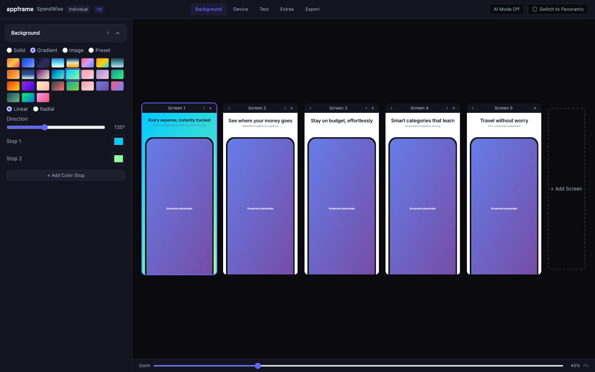
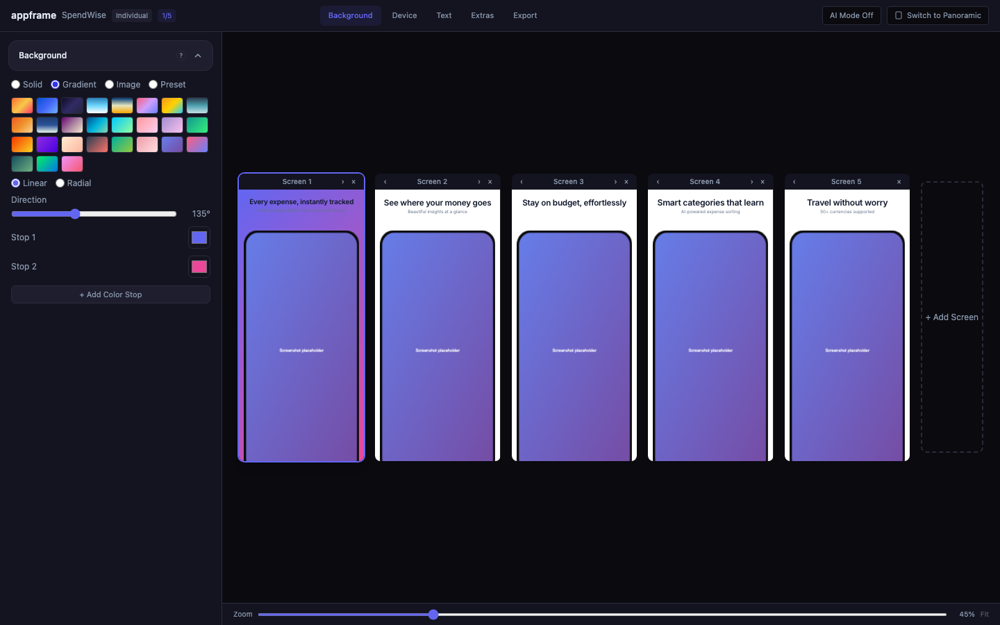
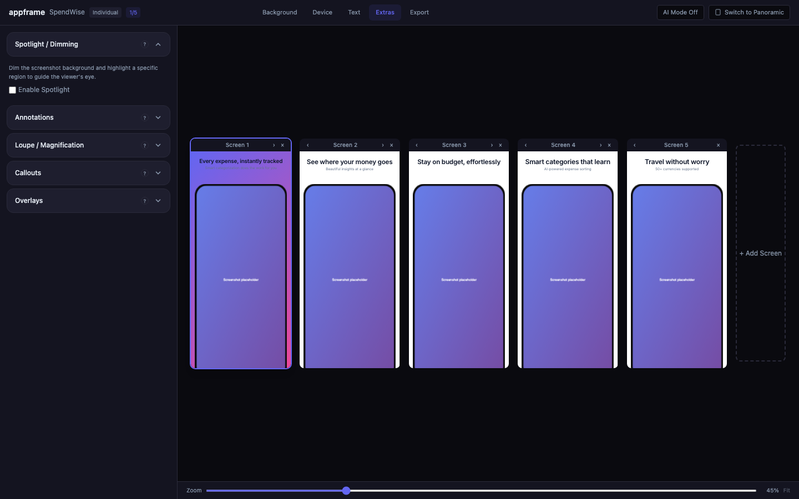
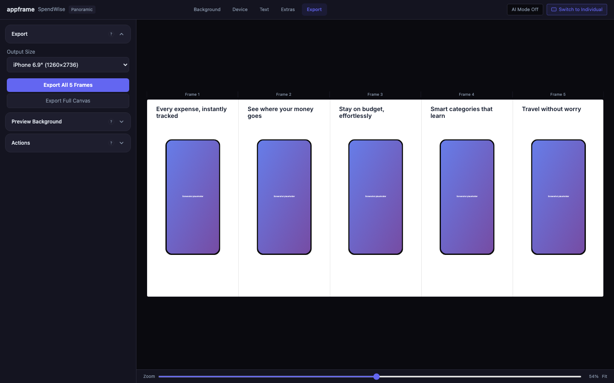
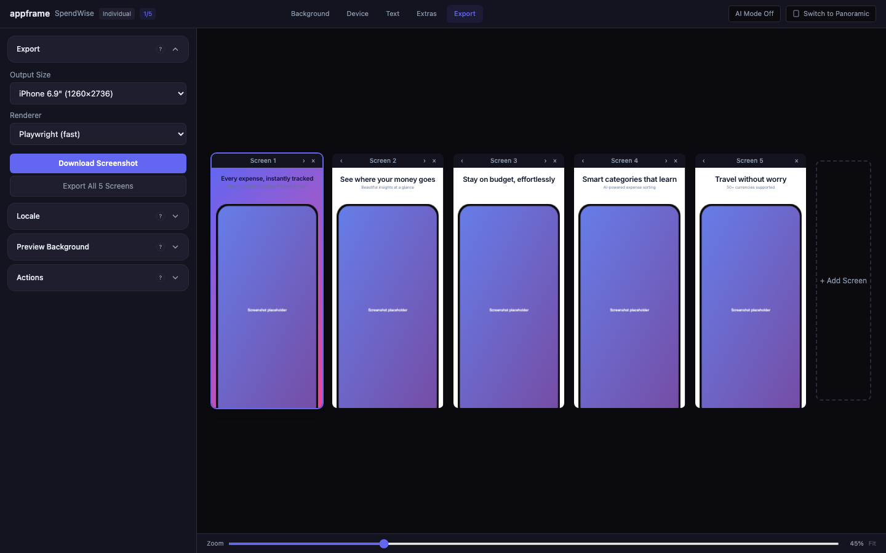

# appframe

Open-source tool for generating professional App Store & Play Store promotional screenshots.

Takes raw app screenshots and transforms them into polished, store-ready promotional images with device frames, headlines, styled backgrounds, and professional layouts.

<p align="center">
  
</p>

## Screenshots Are Ads, Not Docs

The #1 mistake developers make with store screenshots: showing UI instead of selling outcomes. Every screenshot should sell **one idea**. You're not documenting features — you're selling a feeling, an outcome, or killing a pain point.

**Good**: "Never miss a workout again." (kills a pain)
**Bad**: "View your workout history with filters, tags, and calendar sync" (feature list)

See [Writing Great Copy](#writing-great-copy) below.

## Features

- **8 template styles**: minimal, bold, glow, playful, clean, branded, editorial, fullscreen
- **9 composition presets**: single, peek-right/left, tilt-right/left, duo-overlap, duo-split, hero-tilt, fanned-cards
- **100+ device frames**: iPhone 17/Air, iPad Pro, Apple Watch, Android, generic frames
- **Multi-platform**: iOS, Android, Mac, and Apple Watch at exact store-required dimensions
- **Multi-language**: Generate screenshots in any language from a single config file
- **Per-screen customization**: Override backgrounds, compositions, and layouts per slide
- **AI-collaborative**: MCP server + AI agent skill for automated screenshot generation with variant support
- **Web preview**: Local browser UI for real-time visual tweaking with drag positioning
- **Auto-capture**: Capture screenshots from iOS Simulator (xcrun) or Android Emulator (adb)
- **Store upload**: Push screenshots directly to App Store Connect and Google Play Console

## Web Preview

Run `appframe preview` to open a local browser UI where you can visually tweak every aspect of your screenshots in real time.

### Background, Device & Text Controls

Configure backgrounds (solid, gradient, image, or preset), select device frames and platforms, edit headlines and subtitles, and adjust typography — all with instant visual feedback.

<p align="center">
  
  
</p>
<p align="center">
  
  
</p>

### Panoramic Mode

Switch to Panoramic mode for a continuous canvas layout where elements can span across frame boundaries — ideal for creating a cohesive visual story across all your App Store screenshots.

<p align="center">
  
</p>

### Export

Choose output sizes for any device class, pick a rendering backend, and export individual screens or all at once.

<p align="center">
  
</p>

## Quick Start

```bash
# Install
npm install -g appframe

# Initialize a config for your app
appframe init --name "My App" --style minimal

# Add your screenshots to the screenshots/ folder, then generate
appframe generate

# Preview in browser
appframe preview
```

## AI Agent Integration

appframe works with AI coding agents (Claude Code, Cursor, Windsurf, and 40+ others) via MCP:

```json
{
  "mcpServers": {
    "appframe": {
      "command": "appframe-mcp"
    }
  }
}
```

### The Canonical Flow

When you ask an agent "create app store screenshots with appframe", it should call a single tool:

**`appframe_run_autopilot`** — analyzes your raw screenshots, plans **4 concepts** (2 individual + 2 panoramic, guaranteed), renders previews, opens the web preview at `http://localhost:4400`, and returns the URL.

You then:
1. Open the URL.
2. Review the 4 variants side-by-side.
3. Pick one, fine-tune it in the UI, or accept as-is.
4. Download the PNGs from the Export tab.

The agent stops after opening the preview — you stay in control of the final pick. Use `appframe_generate` only for headless/batch exports when you already have an approved config.

## Writing Great Copy

Write all headlines **before** designing layouts. Bad copy ruins good design.

### Three Approaches

Use one per slide:

| Approach | What it does | Example |
|----------|-------------|---------|
| **Paint a moment** | Reader pictures themselves doing it | "Check your coffee without opening the app." |
| **State an outcome** | What life looks like after | "A home for every coffee you buy." |
| **Kill a pain** | Name a problem and destroy it | "Never waste a great bag of coffee." |

### The Rules

1. **One idea per headline.** Never join two things with "and."
2. **Short, common words.** 1-2 syllables. No jargon unless domain-specific.
3. **3-5 words per line.** Must be readable at thumbnail size in the App Store.
4. **Line breaks are intentional.** Use `\n` in your YAML to control where lines break.

### What Never Works

- Feature lists: "Log every item with tags, categories, and notes"
- Two ideas with "and": "Track expenses and never miss a bill"
- Vague aspirational: "Every moment, captured"
- Marketing buzzwords: "AI-powered insights" (unless it genuinely is AI)

### Slide Framework

| Slot | Purpose |
|------|---------|
| #1 | **Hero** — app's main benefit, the one thing it does best |
| #2 | **Differentiator** — what makes it unique vs alternatives |
| #3 | **Ecosystem** — widgets, watch, extensions (skip if N/A) |
| #4+ | **Core features** — one per slide, most important first |
| 2nd to last | **Trust signal** — "made for people who [X]" |
| Last | **Summary** — remaining features or coming soon |

## Config File

appframe uses a YAML config file (`appframe.yml`):

```yaml
app:
  name: "FitPulse"
  description: "Personal fitness tracker"
  platforms: [ios, android]
  features:
    - Custom workout plans
    - Progress tracking

theme:
  style: glow
  colors:
    primary: "#6366F1"
    secondary: "#EC4899"
    background: "#0A0A0F"
    text: "#F8FAFC"
    subtitle: "#94A3B8"
  font: space-grotesk
  fontWeight: 700

frames:
  ios: iphone-17-pro
  android: generic-phone
  style: flat

screens:
  # Slide 1: Hero — centered
  - screenshot: screenshots/home.png
    headline: "Your body,\nyour rules."
    subtitle: "Fitness that adapts to you"
    layout: center
    composition: single

  # Slide 2: Differentiator — angled, different background
  - screenshot: screenshots/workouts.png
    headline: "Plans that\nactually work."
    layout: angled-right
    background: "#1E1B4B"

  # Slide 3: Feature — peek right for visual variety
  - screenshot: screenshots/progress.png
    headline: "Watch yourself\nimprove."
    composition: peek-right

  # Slide 4: Feature — peek left (pairs with previous)
  - screenshot: screenshots/challenges.png
    headline: "Compete with\nfriends."
    composition: peek-left
    background: "#18181B"

  # Slide 5: Trust — back to centered
  - screenshot: screenshots/nutrition.png
    headline: "Fuel your\nprogress."
    subtitle: "Built for people who show up"

output:
  platforms: [ios, android]
  ios:
    sizes: [6.7, 6.5]
    format: png
  android:
    sizes: ["phone"]
    format: png
    featureGraphic: true
  directory: ./output
```

## Template Styles

| Style | Description | Best for |
|-------|-------------|----------|
| **minimal** | Clean, light, Apple-style with subtle shadows | Productivity, finance, health, utilities |
| **bold** | Vibrant gradients, large heavy typography, uppercase | Social, entertainment, lifestyle |
| **glow** | Dark premium with glowing color accents | Finance, pro tools, music, photography |
| **playful** | Colorful shapes, fun decorations | Games, education, kids, casual |
| **clean** | Zero decoration, just text + device | Modern no-frills look (YouTube, Uber) |
| **branded** | Strong brand color as background | Apps with strong brand identity |
| **editorial** | Elegant muted tones, italic headings | Lifestyle, wellness, premium |
| **fullscreen** | Full-bleed screenshot, no device frame | Immersive apps |

## Composition Presets

Vary layouts across slides — never use the same composition for every screenshot.

| Preset | Devices | Effect |
|--------|---------|--------|
| `single` | 1 | Default centered device |
| `peek-right` | 1 | Device bleeds off right edge |
| `peek-left` | 1 | Device bleeds off left edge |
| `tilt-left` | 1 | Dramatic tilt overflowing left |
| `tilt-right` | 1 | Dramatic tilt overflowing right |
| `duo-overlap` | 2 | Two overlapping devices |
| `duo-split` | 2 | Two devices on opposite edges |
| `hero-tilt` | 2 | Large hero + smaller background device |
| `fanned-cards` | 3 | Three devices fanned out |

Composition presets set initial device positioning — you can fine-tune scale, rotation, offset, and angle from there via the web preview or YAML config.

**Tip**: Pair `peek-right` on one slide with `peek-left` on the next — when viewed in the App Store, devices appear to span across screenshots.

## CLI Commands

| Command | Description |
|---------|-------------|
| `appframe init` | Create a new config file |
| `appframe generate` | Generate all store screenshots from config |
| `appframe validate` | Validate config (includes copy length warnings) |
| `appframe preview` | Open web preview for visual tweaking |
| `appframe capture` | Auto-capture from simulator/emulator |
| `appframe frames list` | List available device frames |
| `appframe upload` | Upload to App Store Connect / Google Play |
| `appframe setup` | Install optional dependencies (Koubou) |

## MCP Tools

| Tool | Description |
|------|-------------|
| `appframe_init_config` | Create a new config file |
| `appframe_read_config` | Read config contents |
| `appframe_validate_config` | Validate config with warnings |
| `appframe_update_config` | Update config fields |
| `appframe_generate` | Generate all screenshots |
| `appframe_preview_screen` | Render a single screen preview |
| `appframe_list_frames` | List available device frames |
| `appframe_list_templates` | List template styles |
| `appframe_suggest_copy` | AI-guided copy with 3 approaches |
| `appframe_suggest_theme` | AI-guided theme suggestion |
| `appframe_generate_variants` | Generate 2-3 design variant configs |
| `appframe_create_variant_session` | Create a file-backed 2-3 concept session for agent workflows |
| `appframe_list_variant_session` | List concepts, active concept, approvals, and export history |
| `appframe_select_variant` | Switch the active concept in a variant session |
| `appframe_approve_variant` | Mark one concept as approved and demote the rest to draft |
| `appframe_export_variant` | Export one concept from a variant session |
| `appframe_export_approved_variant` | Export the approved concept from a variant session |
| `appframe_upload_plan` | Preview upload plan |
| `appframe_upload` | Upload screenshots to stores |

### Agent Workflow

Appframe now supports a file-backed concept workflow for AI agents. The intended flow is:

1. Create a base config or open an existing `appframe.yml`
2. Ask the agent to create a variant session with 2-3 concepts
3. Let the agent review or refine the concepts
4. Approve one concept
5. Export the approved concept as a structured batch

Example sequence:

```text
appframe_create_variant_session(configPath="/abs/path/appframe.yml", variantCount=3)
appframe_list_variant_session(sessionPath="/abs/path/appframe.variants.session.json")
appframe_select_variant(sessionPath="/abs/path/appframe.variants.session.json", variantId="concept-b")
appframe_approve_variant(sessionPath="/abs/path/appframe.variants.session.json", variantId="concept-c")
appframe_export_approved_variant(sessionPath="/abs/path/appframe.variants.session.json")
```

The variant session JSON stores:
- the source config path
- the active concept
- the approved concept
- per-concept export history

## Store Upload

### App Store Connect

```bash
export ASC_ISSUER_ID="your-issuer-id"
export ASC_KEY_ID="your-key-id"
export ASC_PRIVATE_KEY_PATH="/path/to/AuthKey.p8"
export ASC_APP_ID="your-app-apple-id"
```

### Google Play Console

```bash
export GOOGLE_PLAY_SERVICE_ACCOUNT="/path/to/service-account.json"
export GOOGLE_PLAY_PACKAGE_NAME="com.example.myapp"
```

```bash
appframe upload --dry-run    # Preview what would be uploaded
appframe upload              # Upload to both stores
appframe upload --platform ios
appframe upload --locale es
```

## Output Sizes

### iOS (App Store)

| Display | Output size |
|---------|-------------|
| iPhone 6.7" | 1290 x 2796 |
| iPhone 6.5" | 1284 x 2778 |
| iPhone 6.3" | 1206 x 2622 |
| iPhone 5.5" | 1242 x 2208 |
| iPad 13" | 2064 x 2752 |
| iPad 12.9" | 2048 x 2732 |
| iPad 11" | 1668 x 2388 |

### Android (Google Play)

| Display | Output size |
|---------|-------------|
| Phone | 1080 x 1920 |
| 7" Tablet | 1200 x 1920 |
| 10" Tablet | 1800 x 2560 |
| Feature Graphic | 1024 x 500 |

## Available Fonts

inter, space-grotesk, poppins, montserrat, dm-sans, plus-jakarta-sans, raleway, playfair-display

All fonts are bundled — no external requests needed.

## Rendering Backends

### Playwright (default)

Built-in HTML/CSS renderer. Fast, supports all templates and effects.

```bash
appframe generate --renderer playwright
```

### Koubou (optional)

[Koubou](https://github.com/bitomule/Koubou) provides photorealistic device frames (126+ frames).

```bash
appframe setup              # Install Koubou
appframe generate --renderer koubou
appframe generate --renderer auto   # Uses Koubou if available
```

| | Playwright | Koubou |
|---|---|---|
| Speed | ~1.5s per image | ~7s per image |
| Device frames | SVG overlays (100+) | Photorealistic bezels (126+) |
| Text rendering | Embedded web fonts | System fonts |
| Background effects | Full CSS | Gradients only |

## Development

```bash
git clone https://github.com/your-username/appframe.git
cd appframe
pnpm install
pnpm build
pnpm test
pnpm dev    # Watch mode
```

### Project Structure

```
packages/
  core/           Config, templates, renderer, frame management
  cli/            Commander.js CLI
  mcp-server/     MCP server for AI agents
  web-preview/    Express preview server with browser UI
  store-upload/   App Store Connect + Google Play upload
skills/           AI agent skill (SKILL.md)
frames/           Device frame assets + manifest
fonts/            Bundled web fonts
examples/         Example app configs
```

## Requirements

- Node.js >= 18
- Playwright (auto-installed on first run)
- Koubou (optional) — `pip install koubou`

## License

MIT
